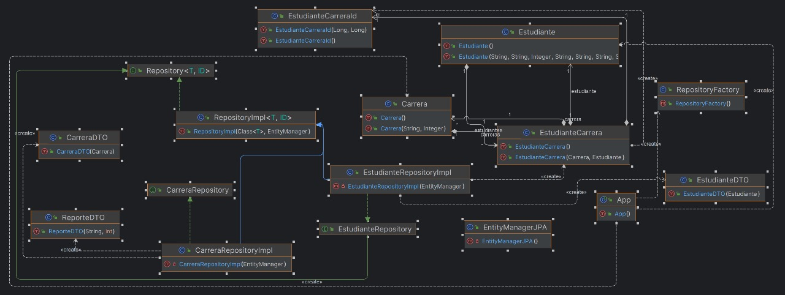

## Descripción del Proyecto

Este sistema permite registrar estudiantes con la siguiente información:
- Nombres
- Apellido
- Edad
- Género
- Número de documento
- Ciudad de residencia
- Número de libreta universitaria
- Carrera(s) en las que está inscripto
- Antigüedad en cada una de esas carreras
- Graduación (sí o no)

## Tecnologías Utilizadas
- Java
- JPA (Java Persistence API)
- Hibernate (como ORM)
- JPQL (Java Persistence Query Language)
- Docker (para la base de datos)

##Diagramas

###Diagrama de Objetos
 
  

###Diagrama DER

   
  
## Funciones Implementadas

1. **Dar de alta un estudiante**
2. **Matricular un estudiante en una carrera**
3. **Recuperar todos los estudiantes con criterios de ordenamiento**
4. **Recuperar un estudiante por su número de libreta universitaria**
5. **Recuperar estudiantes según su género**
6. **Recuperar carreras con estudiantes inscriptos, ordenados por cantidad**
7. **Recuperar estudiantes de una carrera filtrando por ciudad de residencia**
8. **Generar un reporte de inscriptos y graduados por carrera ordenados cronologicamente por año**

Aqui el codigo para dicha funcionalidad esta comentado por defecto, ve comentando y descomentando a gusto para probar las funcionadades

```
        //EJECUTAR SOLO UNA VEZ
        /*cargador.leerEstudiantes();
        cargador.leerCarreras();
        cargador.leerEstudiantesCarreras();**/


        //2)


         //a) dar de alta un estudiante
        //estudianteRepo.save(new Estudiante()); //por defecto se crea uno vacio


        //b) matricular un estudiante en una carrera

        // ej: estudianteRepo.matricularEstudianteEnCarrera(dniEstudiante, id_carrera, inscripcion, graduacion, antiguedad)
        // en el codigo esta comentado como si no fuera un codigo, para evitar errores de compilacion, con este ejemplo deberias ser capaz de usarlo sin problemas
        

        //d) RECUPERAR UN ESTUDIANTE, EN BASE A SU NUMERO DE LIBRETA UNIVERSITARIA.
        //System.out.println(estudianteRepo.obtenerEstudianteLibreta("61607"));

        //e) RECUPERAR TODOS LOS ESTUDIANTES EN BASE A SU GENERO
        //System.out.println(estudianteRepo.obtenerEstudiantesPorGenero("Polygender"));

        //c) RECUPERAR TODOS LOS ESTUDIANTES , Y ESPECIFICAR ALGUN CRITERIO DE ORDENAMIENTO SIMPLE.
        //System.out.println(estudianteRepo.obtenerEstudiantesOrdenados("apellido"));

        //f) RECUPERAR LA CARRERAS CON ESTUDIANTES INSCRIPTOS, Y ORDERNAR POR CANTIDAD.
        //System.out.println(carreraRepo.obtenerCarrerasConEstudiantesInscriptos());

        //g) RECUPERAR A TODOS LOS ESTUDIANTES DE UNA DETERMINADA CARRERA, FILTRADOS POR CIUDAD DE RESIDENCIA.
        //System.out.println(estudianteRepo.obtenerEstudiantesPorCarreraYCiudad(15L,"Jiaoyuan"));

        //3) reporte inscriptos y graduados de las carreras ordenados cronologicamente por año

        /*for(ReporteDTO r: carreraRepo.generarReporteCarreras()) {
            System.out.println(r);
        }**/
```


## Carga de datos

    //cargador.leerEstudiantes();
    //cargador.leerCarreras();
    //cargador.leerEstudiantesCarreras();

### Solo se debe usar una vez, luego comentar para que no se vuelvan a cargar los mismos datos

##  Configuraciones de la base de datos

### persitence.xml

    spring.datasource.url=jdbc:mysql://localhost:3306/tu_base_de_datos
    spring.datasource.username=tu_usuario
    spring.datasource.password=tu_contraseña
    spring.jpa.hibernate.ddl-auto=update
    
### docker-compose.yml

#### Levantar con: 

    docker-compose up -d
    
#### Si utilizas el IDE IntellijIDea puedes levantarlo aun mas facilmente haciendo click en el boton de start en el archivo .yml o en la seccion de servicio en la pestaña de docker    


   
